# cam-track

Real-time multi-camera object tracking and analytics: ingest video streams,
detect and track objects within each camera, re-identify the same object
across cameras that share a physical zone, and serve the results as
foot-traffic/inventory analytics on a live dashboard.

## What this project does

`cam-track` turns raw camera feeds (RTSP streams, or video files for a
no-hardware demo) into queryable analytics: how many distinct people or
vehicles passed through a camera in the last hour, and whether the same
object was seen on more than one camera in the same physical area. It is
built as five independently scalable services connected by a message
broker, not a single monolithic script, so that detection/tracking
throughput can be scaled up without touching ingestion or storage.

## How to run it

### Quickest path: unit tests only (no external services)

```bash
./scripts/setup.sh              # creates .venv, installs requirements.txt + requirements-dev.txt
source .venv/bin/activate
pytest                          # runs the full suite; DB/broker/API tests
                                 # auto-skip if psycopg2/fakeredis/fastapi aren't installed
```

### Full local demo (Docker Compose)

```bash
cp .env.example .env            # adjust if needed; defaults work with the compose stack

# Get a detector model (a generic COCO pretrained checkpoint is enough for a demo):
python -c "from ultralytics import YOLO; YOLO('yolov8n.pt')"     # downloads yolov8n.pt
python scripts/export_onnx.py --weights yolov8n.pt --output models/yolov8n.onnx

# Point at least one camera in configs/cameras.yaml at a real RTSP URL or a
# video file under sample_data/ (see sample_data/README.md), then:
./scripts/run_demo.sh
```

Then open `http://localhost:8080` for the dashboard. `docker compose logs -f`
tails every service; `docker compose down` stops the stack.

### Running one service directly (no Docker)

```bash
source .venv/bin/activate
python -m src.ingestion.main      # needs REDIS_URL and CAMERA_CONFIG_PATH
python -m src.inference.main      # needs REDIS_URL and DETECTOR_WEIGHTS_PATH
python -m src.storage.main        # needs REDIS_URL and TIMESCALE_DSN
uvicorn src.dashboard.app:app --reload   # needs TIMESCALE_DSN
```

Every setting has an environment variable with a safe local default -- see
`.env.example` and `src/config/settings.py`.

## Architecture overview

```mermaid
flowchart LR
    CAM[RTSP camera / video file] -- "video frames" --> ING[Ingestion service]
    ING -- "JPEG frame" --> FS[(Frame store: shared volume)]
    ING -- "RawFrame (frame_uri ref)" --> RAWQ[["Redis Stream:
raw frames"]]

    RAWQ -- "RawFrame" --> INF1[Inference worker 1]
    RAWQ -- "RawFrame" --> INF2[Inference worker N]
    FS -- "frame bytes" --> INF1
    FS -- "frame bytes" --> INF2

    INF1 -- "Detection batch" --> TRK1[ByteTrack
per camera]
    TRK1 -- "Track" --> RID[Re-ID: appearance
embedding + gallery]
    RID -- "TrackEvent
(+ global_identity_id)" --> EVQ[["Redis Stream:
track events"]]

    EVQ -- "TrackEvent batch" --> STO[Storage writer]
    STO -- "batched INSERT
(idempotent on event_id)" --> DB[(TimescaleDB:
track_events + continuous aggregate)]

    DB -- "SQL: per-minute counts" --> DASH[Dashboard API
FastAPI]
    DASH -- "JSON" --> UI[Browser: chart + table]

    ING -. "reconnect w/ backoff
on camera failure" .-> ING
    RAWQ -. "XACK only after
successful processing" .-> INF1
    STO -. "ON CONFLICT DO NOTHING
on redelivered event_id" .-> DB
```



Ingestion reads frames off each camera (one reconnect-on-failure loop per
camera, see `src/ingestion/rtsp_reader.py`), writes the JPEG to a shared
frame store, and publishes a small `RawFrame` reference (not the image
bytes -- see ADR 0003) to a Redis Stream. Any number of stateless inference
workers consume that stream, batch frames dynamically for GPU/CPU
throughput (`src/inference/batcher.py`), run detection, run a ByteTrack
tracker scoped to that camera, resolve cross-camera identity through an
appearance-embedding gallery, and publish `TrackEvent`s to a second
stream. A storage writer batches those into TimescaleDB idempotently
(safe under the at-least-once delivery every stage assumes), and the
dashboard's FastAPI service serves pre-aggregated analytics from a
continuous aggregate, not raw event scans.

## Key concepts and technology choices

Every non-obvious choice below is explained in full (what it is, why it
was chosen, what else was considered) in a linked ADR -- read those before
changing the underlying technology:

- **YOLOv8** for detection, not a two-stage detector --
  [ADR 0001](docs/decisions/0001-detector-choice.md)
- **ByteTrack**, with cross-camera re-ID as a separate stage, not
  DeepSORT's combined motion+appearance tracker --
  [ADR 0002](docs/decisions/0002-tracker-choice.md)
- **Redis Streams** as the default message broker, Kafka as a supported
  alternate backend -- [ADR 0003](docs/decisions/0003-message-queue-choice.md)
- **TimescaleDB** for analytics storage, not a dedicated time-series DB or
  plain Postgres -- [ADR 0004](docs/decisions/0004-storage-choice.md)
- **ONNX export + dynamic batching** for both edge and cloud inference,
  and horizontal scaling of stateless inference workers --
  [ADR 0005](docs/decisions/0005-edge-vs-cloud.md)

## Complexity notes

Non-trivial functions carry inline `# Time: / # Space:` complexity
comments at their definition. The ones worth knowing up front:

- `src/inference/tracker.py`'s `ByteTracker.update()`: O(t) Kalman
  predicts plus two Hungarian assignment solves bounded by O(t * d) each
  (t = active tracks in that camera, d = detections in that frame).
- `src/reid/cross_camera_matcher.py`'s `CrossCameraMatcher.observe()`:
  O(g) linear scan over one zone's live gallery entries (g bounded by
  recent activity in that zone, not total historical identities) --
  documented there as the point past which an ANN index would be needed.
- `src/inference/detector.py`'s `_nms()`: O(n^2) worst case, appropriate
  for YOLO's typical low-hundreds candidate counts post-confidence-filter,
  not for arbitrarily large candidate sets.

## Testing

```bash
pytest                                    # full suite
pytest --cov=src --cov-report=term-missing   # with coverage
```

Every module with non-trivial logic has real unit tests (happy path,
boundary conditions, and documented error/edge behavior -- not just
smoke tests): the ByteTrack association state machine, the Kalman filter's
convergence behavior, the dynamic batcher's dual size/time flush bounds
(including a regression test for a real bug caught while writing these
tests, where `stop()` could hang on an idle batcher), the RTSP reader's
reconnect/backoff logic, the cross-camera re-ID gallery's matching and
expiry, and the storage layer's idempotent-write guarantee.

Tests that need an optional heavy dependency (`fakeredis` for the Redis
broker, `psycopg2` for TimescaleDB, `fastapi` for the dashboard API) call
`pytest.importorskip` and skip cleanly rather than failing when that
dependency is not installed -- install `requirements-dev.txt` (which
includes all three) to run the complete suite. Not intentionally covered:
`OnnxYoloDetector`/`UltralyticsYoloDetector`/`OnnxReidEmbedder` end-to-end
(they need real model weights this scaffold does not ship); their pure
pre/post-processing logic (NMS, IoU, output decoding) is tested directly
instead.

CI (`.github/workflows/ci.yml`) runs lint, the 99-character line-length
check, and the full test suite with coverage on every push and PR.

## Compatibility policy

This project is pre-1.0 and the wire schemas
(`src/common/schemas.py`) and SQL schema (`src/storage/schema.sql`) are the
contracts every service shares. Concretely: existing fields on `RawFrame`,
`Detection`, `Track`, `TrackEvent`, and `ReidMatch` are not renamed or
repurposed, only added to; the `track_events` table gains columns
additively, never drops or retypes one in place. Any change that cannot be
made additively is called out explicitly (in a PR description and an ADR
update), not made silently, since ingestion, inference, storage, and
dashboard are deployed and versioned independently and must be able to run
temporarily mismatched during a rolling deploy.
