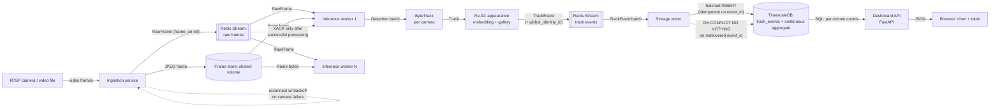

# cam-track

Real-time multi-camera object tracking and analytics: ingest video streams,
detect and track objects within each camera, re-identify the same object
across cameras that share a physical zone, and serve the results as
foot-traffic/inventory analytics on a live dashboard.

## What this project does

`cam-track` turns raw camera feeds (RTSP streams, or video files for a
no-hardware demo) into queryable analytics: how many distinct people or
vehicles passed through a camera in the last hour, and whether the same
object was seen on more than one camera in the same physical area. It is
built as five independently scalable services connected by a message
broker, not a single monolithic script, so that detection/tracking
throughput can be scaled up without touching ingestion or storage.

Concretely, the problem this solves: a retail store, warehouse, or office
wants to know how many people or vehicles moved through different cameras,
and whether the same person seen on one camera is the same person seen
later on another camera covering the same area -- without a human
watching video feeds all day. The pipeline gets there in five stages,
each its own service:

1. **Ingestion** reads frames off each camera (a real RTSP stream, or a
   video file for a no-hardware demo) at a controlled rate and hands them
   off.
2. **Inference** runs a detection model (YOLOv8) on each frame to find
   objects and their pixel locations. A detector alone has no memory
   between frames -- it doesn't know the person in frame 47 is the same
   person as in frame 48.
3. **Tracking** (a ByteTrack-style algorithm, the hardest and most
   differentiating part of this project) solves that memory problem: it
   stitches detections across consecutive frames into a temporally
   consistent identity -- "object 1 has been on camera 1 since frame 40,
   moving in this direction."
4. **Re-identification** answers the harder question: is the person
   tracked on camera 1 the same physical person who just appeared on
   camera 2? It compares a visual "fingerprint" (an appearance embedding)
   of each tracked object against a gallery of recently seen fingerprints
   in the same physical zone.
5. **Storage + dashboard** writes everything to a time-series database and
   serves it through a small web dashboard, so traffic counts over time
   are a query away instead of a raw event-log scan.

All five stages talk to each other through a message queue (Redis Streams
by default) instead of calling each other directly, which is what lets the
expensive, GPU-hungry inference stage scale out independently of
ingestion or storage when camera count grows. `docs/decisions/` has one
short document per major technology choice explaining what was picked,
why, and what else was considered -- read those for the reasoning behind
the architecture, not just what it does.

## How to run it

### Demo mode vs. production: what `source` actually means

Everything in this section runs **demo mode**, and it's worth being clear
about how that differs from a real deployment before diving in.

**Demo mode** (what every command below does): there's no physical camera
involved anywhere. A video file on disk stands in for a camera's live
feed -- `RtspFrameReader` (`src/ingestion/rtsp_reader.py`) reads a local
file exactly the way it reads a network stream, frame by frame, at the
configured `fps_cap`. That's why you manually place a video file and
point a `configs/cameras.yaml` entry's `source` at it -- a step a real
deployment never has.

**Production** (the real thing this is modeling, not built out in this
repo): `source` would be a permanent RTSP URL pointing at an actual
physical camera (`rtsp://192.168.1.50:554/stream`), set once when that
camera is installed. From then on, ingestion reads that live stream
continuously, forever -- there is no repeated "pick a video to analyze"
step, ever; a camera isn't a library of clips to choose between, it's one
continuous feed. Registering a *new* camera does still mean a config
change and a restart (see the "known limitations" note below), but that's
a one-time event per camera, not an ongoing task. `docker-compose.yml`'s
single `ingestion` container is also a demo simplification:
`src/ingestion/main.py`'s docstring notes that a real deployment runs one
ingestion *container* per camera instead (so one failing camera can never
affect another, and cameras are added/removed by deploying or tearing
down a container rather than editing a shared config and restarting a
shared process) -- the "one process, one thread per camera" model used
here is what that container falls back to for local multi-camera
development. Redis and TimescaleDB would likewise be managed, durable
services in production, not throwaway `docker compose` containers whose
data disappears on `docker compose down -v`.

### Quickest path: unit tests only (no external services)

`./scripts/setup.sh` creates a virtualenv and installs `requirements.txt` +
`requirements-dev.txt`. Tests that need psycopg2/fakeredis/fastapi
auto-skip if those aren't installed.

```bash
./scripts/setup.sh
source .venv/bin/activate
pytest
```

### Full local demo (Docker Compose)

Needs Docker Desktop installed and running (get it from
[docker.com/products/docker-desktop](https://www.docker.com/products/docker-desktop)
if `docker --version` doesn't already work). You don't need to check this
by hand, though -- `./scripts/run_demo.sh` (the last step below) checks
Docker, `.env`, the exported model, and every camera source file itself
before starting anything, and tells you exactly what's missing and how to
fix it rather than failing partway through with a cryptic error.

`.env` gets created automatically from `.env.example` on first run if it
doesn't exist yet (its defaults already work with the compose stack, so no
edits are required to get the demo running); create it yourself first only
if you want non-default values:

```bash
cp .env.example .env
```

Get a detector model -- a generic COCO pretrained checkpoint is enough for
a demo -- and export it to ONNX. This needs `ultralytics`
(`requirements-ml.txt`), which `requirements.txt` deliberately leaves out
since production only needs the exported `.onnx` file, not the training
framework -- see [ADR 0001](docs/decisions/0001-detector-choice.md):

```bash
pip install ultralytics
python3 -c "from ultralytics import YOLO; YOLO('yolov8n.pt')"
python3 scripts/export_onnx.py --weights yolov8n.pt --output models/yolov8n.onnx
```

(`pip install ultralytics` alone is enough just to export a model. If you
want the full `requirements-ml.txt` -- e.g. to use the Kafka message
broker backend -- run `./scripts/install_ml_deps.sh` instead of installing
it with plain pip; it checks for and installs the `librdkafka` system
library `confluent-kafka` needs first, which a plain `pip install` doesn't
do and will fail on without it.)

Point at least one camera in `configs/cameras.yaml` at a real RTSP URL or
a video file under `sample_data/` (see `sample_data/README.md`).

If you don't have a real camera, grab any short video with people or
vehicles in it -- a phone recording, a screen recording, or a free stock
clip (e.g. Pexels or Pixabay video, no attribution required) all work.
30 seconds to a couple of minutes at 720p or lower is plenty; a long or
high-resolution file just makes the demo slower to process without adding
anything useful. Save it into `sample_data/` and point a camera entry's
`source` at it. Anything under `sample_data/` matching `*.mp4`, `*.avi`,
`*.mov`, `*.mkv`, or `*.webm` is already covered by `.gitignore`, so
whatever you drop in there for local testing will not end up in the
(public) repo -- see `sample_data/README.md`. If a `source:` path doesn't
exist when you run the demo, `./scripts/run_demo.sh` will say exactly
which one before starting anything, rather than failing inside a
container where it's harder to see.

Then:

```bash
./scripts/run_demo.sh
```

Then open `http://localhost:8080` for the dashboard. `docker compose logs -f`
tails every service; `docker compose down` stops the stack.

### Running one service directly (no Docker)

This is a development alternative to the Docker Compose demo above, not a
replacement for it: instead of one command starting every container,
you run each Python service directly on your machine (useful for
attaching a debugger or iterating without rebuilding an image).

Two things this mode does *not* do for you, unlike `./scripts/run_demo.sh`:

- **It doesn't start Redis or TimescaleDB.** Running `python -m
  src.ingestion.main` without them running first fails immediately with
  `redis.exceptions.ConnectionError: ... Connection refused` on
  `localhost:6379`. Start just the infra pieces via Docker first (still
  using Docker for Redis/TimescaleDB while running the Python services
  natively), then run the four commands below:

  ```bash
  docker compose up -d redis timescaledb
  ```

  (Or install both locally instead of via Docker, if you'd rather not use
  Docker at all.)
- Each command below is a long-running server/worker that blocks forever
  once started -- run every line in its own terminal tab or window at the
  same time, not pasted one after another into a single terminal expecting
  them to run in sequence.

Each service reads its settings from environment variables -- ingestion
needs `REDIS_URL` and `CAMERA_CONFIG_PATH`, inference needs `REDIS_URL` and
`DETECTOR_WEIGHTS_PATH`, storage needs `REDIS_URL` and `TIMESCALE_DSN`, and
the dashboard needs `TIMESCALE_DSN` -- set in `.env` or exported directly.

**Yes, these four go in four separate terminal windows/tabs, running at
the same time** -- not one after another in the same terminal. Each one
is its own long-running process; the first will just sit there and never
hand control back, so pasting all four into one terminal would never get
past the first line.

Terminal 1 -- ingestion:

```bash
source .venv/bin/activate
python -m src.ingestion.main
```

Terminal 2 -- inference:

```bash
source .venv/bin/activate
python -m src.inference.main
```

Terminal 3 -- storage:

```bash
source .venv/bin/activate
python -m src.storage.main
```

Terminal 4 -- dashboard:

```bash
source .venv/bin/activate
uvicorn src.dashboard.app:app --reload
```

Every setting has an environment variable with a safe local default -- see
`.env.example` and `src/config/settings.py`.

## Architecture overview


```mermaid
flowchart LR
    CAM[RTSP camera / video file] -- "video frames" --> ING[Ingestion service]
    ING -- "JPEG frame" --> FS[(Frame store: shared volume)]
    ING -- "RawFrame (frame_uri ref)" --> RAWQ[["Redis Stream:
raw frames"]]

    RAWQ -- "RawFrame" --> INF1[Inference worker 1]
    RAWQ -- "RawFrame" --> INF2[Inference worker N]
    FS -- "frame bytes" --> INF1
    FS -- "frame bytes" --> INF2

    INF1 -- "Detection batch" --> TRK1[ByteTrack
per camera]
    TRK1 -- "Track" --> RID[Re-ID: appearance
embedding + gallery]
    RID -- "TrackEvent
(+ global_identity_id)" --> EVQ[["Redis Stream:
track events"]]

    EVQ -- "TrackEvent batch" --> STO[Storage writer]
    STO -- "batched INSERT
(idempotent on event_id)" --> DB[(TimescaleDB:
track_events + continuous aggregate)]

    DB -- "SQL: per-minute counts" --> DASH[Dashboard API
FastAPI]
    DASH -- "JSON" --> UI[Browser: chart + table]

    ING -. "reconnect w/ backoff
on camera failure" .-> ING
    RAWQ -. "XACK only after
successful processing" .-> INF1
    STO -. "ON CONFLICT DO NOTHING
on redelivered event_id" .-> DB
```

Ingestion reads frames off each camera (one reconnect-on-failure loop per
camera, see `src/ingestion/rtsp_reader.py`), writes the JPEG to a shared
frame store, and publishes a small `RawFrame` reference (not the image
bytes -- see ADR 0003) to a Redis Stream. Any number of stateless inference
workers consume that stream, batch frames dynamically for GPU/CPU
throughput (`src/inference/batcher.py`), run detection, run a ByteTrack
tracker scoped to that camera, resolve cross-camera identity through an
appearance-embedding gallery, and publish `TrackEvent`s to a second
stream. A storage writer batches those into TimescaleDB idempotently
(safe under the at-least-once delivery every stage assumes), and the
dashboard's FastAPI service serves pre-aggregated analytics from a
continuous aggregate, not raw event scans.

## Key concepts and technology choices

Every non-obvious choice below is explained in full (what it is, why it
was chosen, what else was considered) in a linked ADR -- read those before
changing the underlying technology:

- **YOLOv8** for detection, not a two-stage detector --
  [ADR 0001](docs/decisions/0001-detector-choice.md)
- **ByteTrack**, with cross-camera re-ID as a separate stage, not
  DeepSORT's combined motion+appearance tracker --
  [ADR 0002](docs/decisions/0002-tracker-choice.md)
- **Redis Streams** as the default message broker, Kafka as a supported
  alternate backend -- [ADR 0003](docs/decisions/0003-message-queue-choice.md)
- **TimescaleDB** for analytics storage, not a dedicated time-series DB or
  plain Postgres -- [ADR 0004](docs/decisions/0004-storage-choice.md)
- **ONNX export + dynamic batching** for both edge and cloud inference,
  and horizontal scaling of stateless inference workers --
  [ADR 0005](docs/decisions/0005-edge-vs-cloud.md)

## Complexity notes

Non-trivial functions carry inline `# Time: / # Space:` complexity
comments at their definition. The ones worth knowing up front:

- `src/inference/tracker.py`'s `ByteTracker.update()`: O(t) Kalman
  predicts plus two Hungarian assignment solves bounded by O(t * d) each
  (t = active tracks in that camera, d = detections in that frame).
- `src/reid/cross_camera_matcher.py`'s `CrossCameraMatcher.observe()`:
  O(g) linear scan over one zone's live gallery entries (g bounded by
  recent activity in that zone, not total historical identities) --
  documented there as the point past which an ANN index would be needed.
- `src/inference/detector.py`'s `_nms()`: O(n^2) worst case, appropriate
  for YOLO's typical low-hundreds candidate counts post-confidence-filter,
  not for arbitrarily large candidate sets.

## Testing

Run the full suite, or with coverage:

```bash
pytest
pytest --cov=src --cov-report=term-missing
```

Every module with non-trivial logic has real unit tests (happy path,
boundary conditions, and documented error/edge behavior -- not just
smoke tests): the ByteTrack association state machine, the Kalman filter's
convergence behavior, the dynamic batcher's dual size/time flush bounds
(including a regression test for a real bug caught while writing these
tests, where `stop()` could hang on an idle batcher), the RTSP reader's
reconnect/backoff logic, the cross-camera re-ID gallery's matching and
expiry, and the storage layer's idempotent-write guarantee.

Tests that need an optional heavy dependency (`fakeredis` for the Redis
broker, `psycopg2` for TimescaleDB, `fastapi` for the dashboard API) call
`pytest.importorskip` and skip cleanly rather than failing when that
dependency is not installed -- install `requirements-dev.txt` (which
includes all three) to run the complete suite. Not intentionally covered:
`OnnxYoloDetector`/`UltralyticsYoloDetector`/`OnnxReidEmbedder` end-to-end
(they need real model weights this scaffold does not ship); their pure
pre/post-processing logic (NMS, IoU, output decoding) is tested directly
instead.

CI (`.github/workflows/ci.yml`) runs lint, the 99-character line-length
check, and the full test suite with coverage on every push and PR.

## Known limitations

- **Camera registration is config-as-code, not self-service.** Adding or
  removing a camera means editing `configs/cameras.yaml` and restarting
  the ingestion service -- `load_camera_configs()` (`src/ingestion/
  camera_config.py`) runs once at startup, there's no hot-reload or
  file-watching. That's a defensible pattern for a real deployment (the
  camera list lives in version control and changes go through the normal
  deploy pipeline, the same way DNS records or server inventories often
  do), but it means there's no self-service path -- e.g. a store manager
  plugging in a new camera and having it just appear on the dashboard.
  Supporting that would need a database-backed camera registry with an
  admin API/UI, and the ingestion service polling that registry (or
  reacting to a "camera added" event) instead of reading a static file
  once at boot. Not built out here.
- **The exported detector/re-ID models aren't shipped or tested
  end-to-end.** `OnnxYoloDetector`, `UltralyticsYoloDetector`, and
  `OnnxReidEmbedder` need real model weights this repo does not include
  (see "Testing" above); only their pure pre/post-processing logic is
  covered by tests.
- **No authentication on the dashboard API.** `src/dashboard/api/routes.py`
  serves analytics with no access control -- fine for a local demo, not
  for anything exposed beyond localhost.

## Compatibility policy

This project is pre-1.0 and the wire schemas
(`src/common/schemas.py`) and SQL schema (`src/storage/schema.sql`) are the
contracts every service shares. Concretely: existing fields on `RawFrame`,
`Detection`, `Track`, `TrackEvent`, and `ReidMatch` are not renamed or
repurposed, only added to; the `track_events` table gains columns
additively, never drops or retypes one in place. Any change that cannot be
made additively is called out explicitly (in a PR description and an ADR
update), not made silently, since ingestion, inference, storage, and
dashboard are deployed and versioned independently and must be able to run
temporarily mismatched during a rolling deploy.
