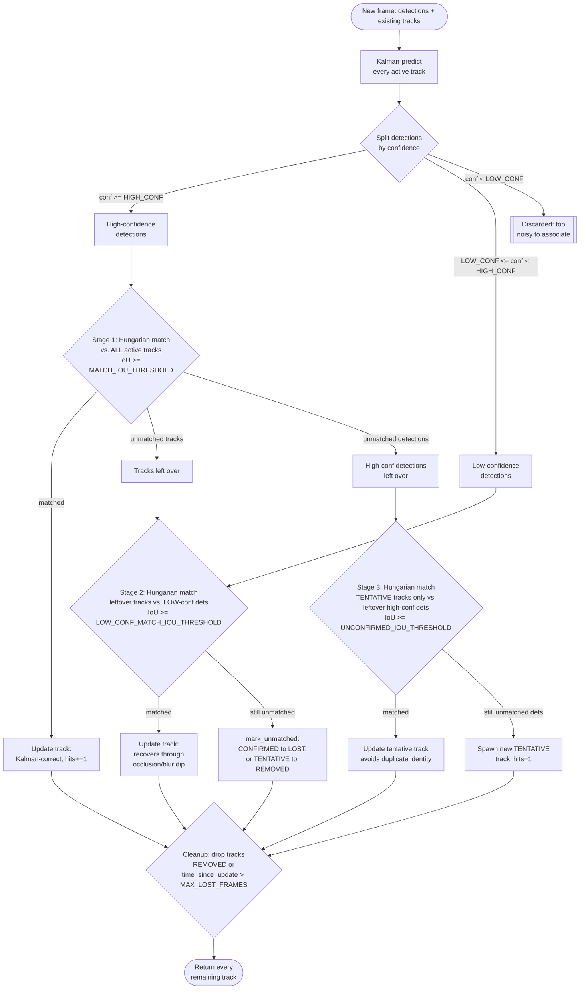

# ByteTrack-lite: per-frame association flow

Referenced from `src/inference/tracker.py`'s `ByteTracker.update()`. Shows
the three association stages every frame's detections go through before
becoming published `Track`s -- see
[ADR 0002](../decisions/0002-tracker-choice.md) for why this shape (two
confidence tiers, three matching passes) beats a single-pass tracker.

